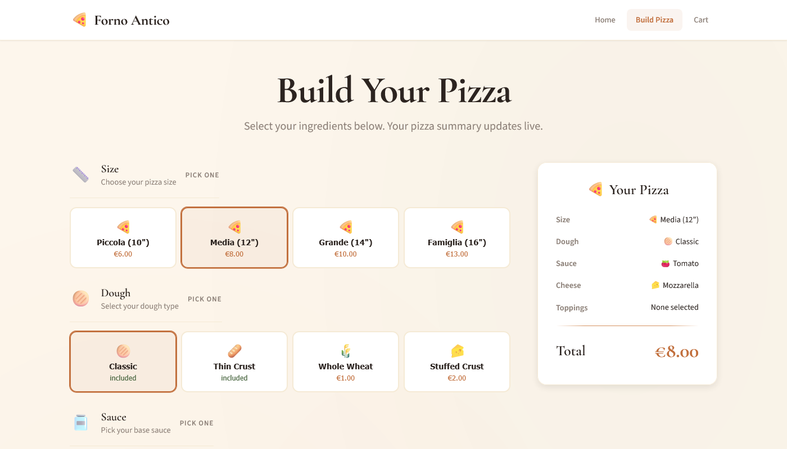

# Pizza Configurator Demo



A simple SvelteKit demo app with 3 pages where users can build custom pizzas and place a dummy order.

## Pages

- `/` — Landing page
- `/configurator` — Pizza builder (size, dough, sauce, cheese, toppings)
- `/order` — Cart and dummy order submission

## State & Persistence

- Centralized class-based state using Svelte 5 runes
- Simple methods for ingredient selection, cart updates, reset, and order placement
- Cart persistence in `localStorage`

## Run

```sh
npm i
npm run build

# preview hotreload dev
npm run dev

# preview prod build
npm run preview
```

## Licence

This project is licensed under the terms in [LICENCE](LICENCE).
